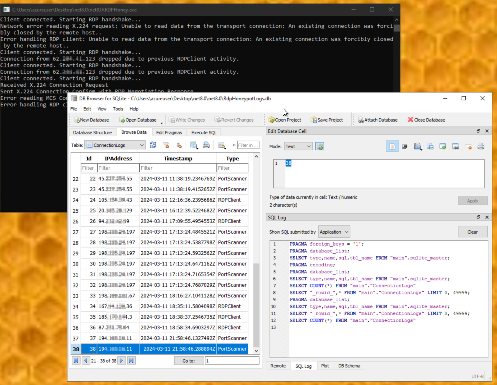

# RDPHoneyPot

A simple RDP honeypot designed to attract, analyze, and inspect RDP-based attacks, developed in C#.

## Features

- Performs basic protocol mocking to distinguish RDP clients/exploits from port scanners.
- Automatically applies bans to IP addresses previously logged in the database as RDP exploiters. Port scanners are still allowed.
- Built with .NET 8 and C#, ensuring a robust and modern development foundation.
- Stores IP addresses, timestamps, and connection types in a SQLite database for detailed analysis.

## Getting Started
### Prerequisites

- .NET 8.0 SDK

### Setup

1. **Clone**: Obtain the code from this repository.
2. **Customize**: Adjust the configuration as needed.
3. **Build**: Use Visual Studio to compile and prepare the honeypot.
