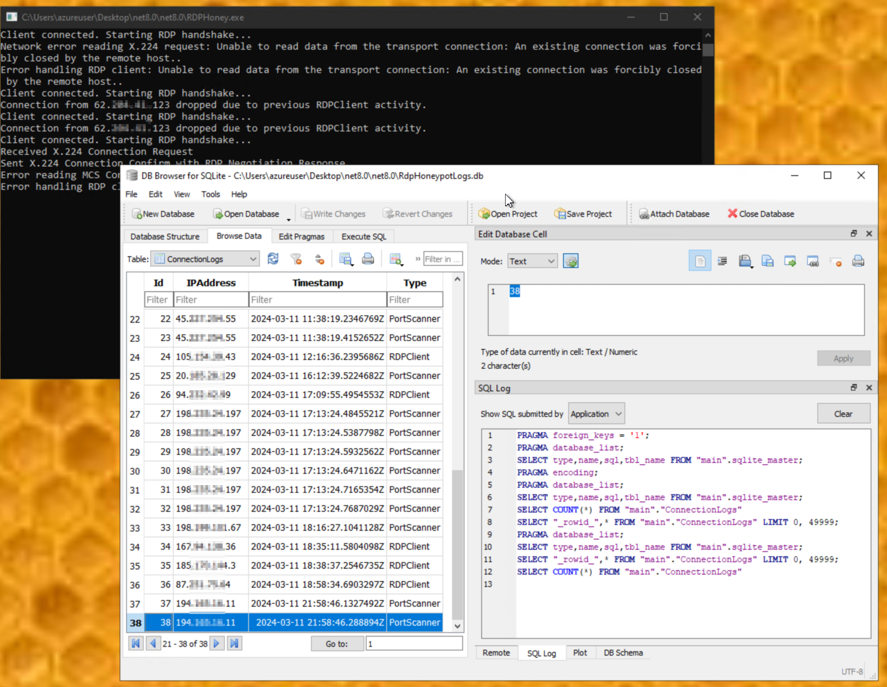

# RDPHoneyPot

A lightweight, high-performance RDP honeypot designed to attract, analyze, and inspect Remote Desktop Protocol (RDP) based attacks and scans, developed in C# and powered by **.NET 10 (LTS)**.

---

## Features

- **Protocol Simulation & TLS Negotiation**: Implements full MS-RDPBCGR negotiation with dynamic self-signed X.509 certificate generation, distinguishing real RDP clients from automated port scanners.
- **Login / Password Prompt Presentation**:
  - **Interactive Clients (`mstsc.exe`, FreeRDP)**: Renders a graphical Windows logon screen, captures keystrokes in real time (Fast-Path input), and accepts any submitted credentials.
  - **Brute-Force Tools (Hydra, Crowbar, Ncrack)**: Extracts usernames and passwords directly from protocol-level Client Info PDUs (`TS_INFO_PACKET`).
- **Credential Logging**: Automatically records captured usernames, passwords, IP addresses, and UTC timestamps to the SQLite database.
- **Static JPG Screen Rendering**: Streams an authentic static desktop image (or custom JPG) to the client's screen upon successful authentication via Fast-Path Bitmap Updates.
- **Randomized Disconnect**: Holds the authenticated session for **3 to 6 seconds at random** before gracefully disconnecting the user.
- **Automated Drop Policy**: Silently drops connections from IP addresses previously logged as RDP exploiters to prevent resource exhaustion.
- **Built on .NET 10 (LTS)**: Native cross-platform execution with modern C# and zero native dependencies.
- **Docker & Docker Compose Ready**: Deployable with a single command via Docker Compose with health monitoring and graceful shutdown.
- **Host-Accessible Database**: Stores logs in `./data/RdpHoneypotLogs.db` via host volume mount. Configured with **WAL (Write-Ahead Logging)** mode for concurrent inspection without locking.
- **Host Web Database UI**: Includes a web-based database management interface (`sqlite-web`) accessible from the host machine at `http://localhost:8080`.
- **Threat Intelligence Enrichment**: Includes PowerShell tooling (`EnrichReportWithIPDB.ps1`) to enrich collected attack logs with AbuseIPDB confidence scores, ISP details, geolocations, and Tor node identification.



---

## Getting Started

### Prerequisites

Choose one of the following:
- **Docker & Docker Compose** (recommended for production/isolated deployment)
- **.NET 10.0 SDK** (for local development or native execution)

---

### Option 1: Deploy with Docker Compose (Recommended)

1. **Clone the repository**:
   ```bash
   git clone https://github.com/your-username/RDPHoneyPot.git
   cd RDPHoneyPot
   ```

2. **Launch the honeypot and database web UI**:
   ```bash
   docker compose up -d --build
   ```

3. **Verify running containers**:
   ```bash
   docker compose ps
   ```

The honeypot is now listening on port `3389` and the database is accessible at `http://localhost:8080`.

---

### Option 2: Run Natively with .NET 10 SDK

1. **Clone and restore dependencies**:
   ```bash
   git clone https://github.com/your-username/RDPHoneyPot.git
   cd RDPHoneyPot
   dotnet restore
   ```

2. **Build the project**:
   ```bash
   dotnet build -c Release
   ```

3. **Run the honeypot**:
   ```bash
   dotnet run --project RDPHoney -c Release
   ```

4. **Run tests**:
   ```bash
   dotnet test
   ```

---

## Credential Capture & Static JPG Simulation

1. **When a user or tool connects**:
   - If credentials are sent in the initial connection packet (e.g. brute-force tools), they are captured immediately.
   - If an interactive user connects (e.g. via Windows Remote Desktop `mstsc.exe`), they are presented with a graphical Windows login prompt.
2. **Acceptance & Logging**:
   - The honeypot accepts any username and password entered by the user.
   - Credentials are saved to `./data/RdpHoneypotLogs.db` under the `ConnectionLogs` table (`Username`, `Password`, `IPAddress`, `Timestamp`).
3. **Static JPG Display**:
   - The honeypot renders `assets/desktop.jpg` to the user's screen.
   - You can customize this by replacing `assets/desktop.jpg` or setting `STATIC_JPG_PATH` in `.env`.
4. **Randomized Disconnect**:
   - After a randomized delay of **3 to 6 seconds**, the honeypot disconnects the session.

---

## Interacting with the Database from the Host Machine

When running in Docker, the database is persisted to `./data/RdpHoneypotLogs.db` on your host machine. Because RDPHoney uses SQLite **Write-Ahead Logging (WAL)**, the host administrator can query and interact with the database while the honeypot is actively capturing traffic:

1. **Web Admin UI**: Open your host browser to `http://localhost:8080` to query tables, filter captured credentials, and export CSV/JSON data.
2. **Desktop GUI Tools**: Open `./data/RdpHoneypotLogs.db` in **DB Browser for SQLite** (as seen in the screenshot above), **DBeaver**, or **DataGrip**.
3. **Command Line**: Inspect logs using `sqlite3`:
   ```bash
   sqlite3 -header -column data/RdpHoneypotLogs.db "SELECT Id, IPAddress, Username, Password FROM ConnectionLogs WHERE Username IS NOT NULL;"
   ```

---

## Configuration

RDPHoney supports configuration via environment variables (or via `.env` with Docker Compose):

| Environment Variable | Default | Description |
|---|---|---|
| `HONEYPOT_PORT` | `3389` | TCP port on which the honeypot listens for RDP traffic. |
| `DATABASE_PATH` | `data/RdpHoneypotLogs.db` | File path to the SQLite database file. |
| `DB_ADMIN_PORT` | `8080` | Port for the SQLite Web administration UI in Docker Compose. |
| `STATIC_JPG_PATH` | `assets/desktop.jpg` | Path to the static JPG rendered to authenticated users. |

See the [Configuration Guide](documentation/CONFIGURATION.md) for full details.

---

## Documentation

Detailed documentation is available in the [`documentation/`](documentation/) directory:

- [**System Architecture**](documentation/ARCHITECTURE.md) — Honeypot packet handling, protocol simulation, credential capture, and classification logic.
- [**Docker Deployment Guide**](documentation/DOCKER_DEPLOYMENT.md) — Complete setup, host volume mounts, cloud firewall rules, and container management.
- [**Database Guide**](documentation/DATABASE_GUIDE.md) — Schema breakdown, WAL mode concurrency, credential queries, and host interaction tools.
- [**Configuration Guide**](documentation/CONFIGURATION.md) — Environment variables, custom ports, and static JPG customization.
- [**Threat Intelligence & Enrichment**](documentation/ANALYSIS_AND_ENRICHMENT.md) — Using `EnrichReportWithIPDB.ps1` with AbuseIPDB and exporting to SIEM.

---

## License

This project is licensed under the MIT License - see the [LICENSE](LICENSE) file for details.
